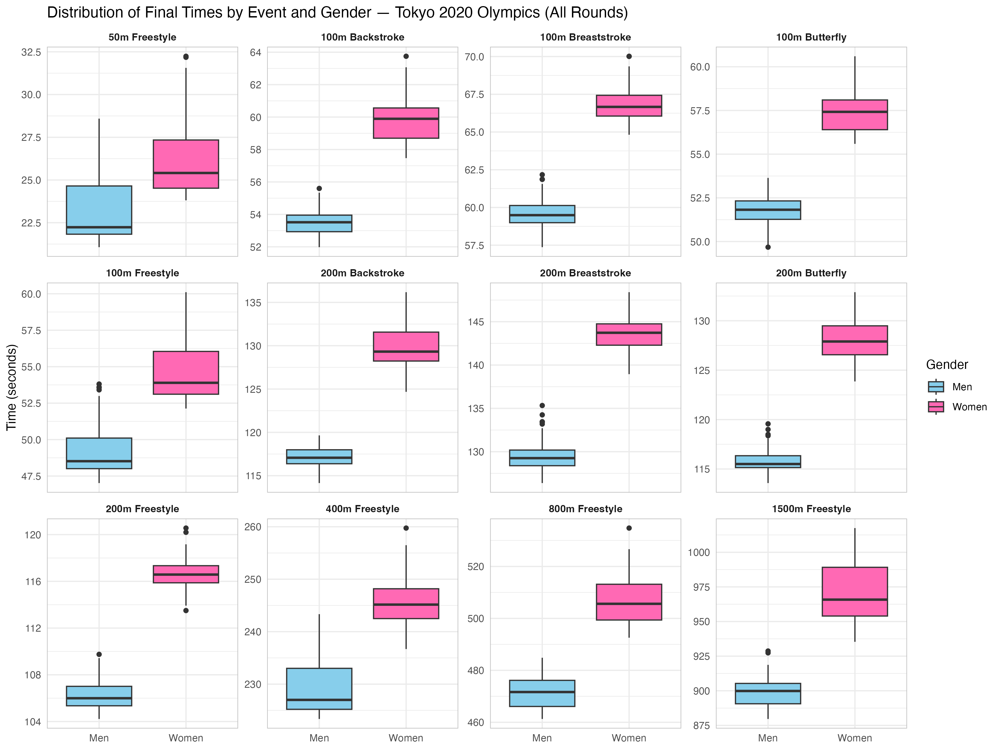

# Tokyo 2020: swimming results and regression analysis

I used R and SwimmeR to import individual-event Olympic swimming results from PDF, clean times and splits, compare performance across events and fit regression models. I also visualised Ariarne Titmus' split-by-split position relative to her closest competitor.



## Supporting examples

- [Completed written report (Word)](swimming_analysis_report.docx).
- [Completed model-results spreadsheet (Excel)](swimming_model_results.xlsx).
- [Event and gender plot](event_time_distributions.png).
- [Titmus split comparison](titmus_split_comparison.png).

The Word report and Excel workbook contain my completed analysis and model results. I have given the portfolio copies descriptive filenames and removed my student identifier from the Word report. This project is an R analysis rather than an interactive dashboard.

## Inspect the analysis

The written report, model-results workbook and saved plots show my completed analysis. The original Olympic results PDFs are excluded from this repository. These examples can be reviewed without downloading the source data.

Open `swimming_analysis.R` to review the workflow. Running it requires the original results PDFs, obtained separately from an authorised source.

## Optional: rerun with local inputs

Open `tokyo_swimming.Rproj` in RStudio. Keep the repository root as the working directory:

```r
install.packages(c("SwimmeR", "tidyverse", "ggrepel"))
source("swimming_analysis.R")
```

The script expects the original results PDFs under:

```text
Tokyo 2020 swimming data/
  Men's individual/
  Women's individual/
```

Supply those inputs locally before running the script; the data directory is ignored by Git. The script imports events, removes disqualifications, converts times, applies an interquartile-range filter, creates plots, and fits reaction-time and multiple-regression models. It does not regenerate the Word report or spreadsheet.

## Interpretation and sources

I use [SwimmeR](https://cran.r-project.org/package=SwimmeR), developed by Greg Pilgrim and contributors, to parse the supplied results. The source PDFs represent third-party Olympic results material and retain their original rights.

The report discusses weak predictive performance for reaction-time-only models. Small event-specific samples, filtering decisions and repeated athletes across rounds can affect model evaluation. The 5,000 m prediction extrapolates beyond the individual pool distances represented in the data; it should not be interpreted as a validated open-water forecast.

The plots and completed documents are saved examples from my analysis. The portfolio copies use descriptive filenames, and the report omits my student identifier. Repository preparation did not rerun the analysis or verify the reported metrics. See [REVIEW_BEFORE_PUBLIC.md](REVIEW_BEFORE_PUBLIC.md) and [RIGHTS.md](RIGHTS.md).
